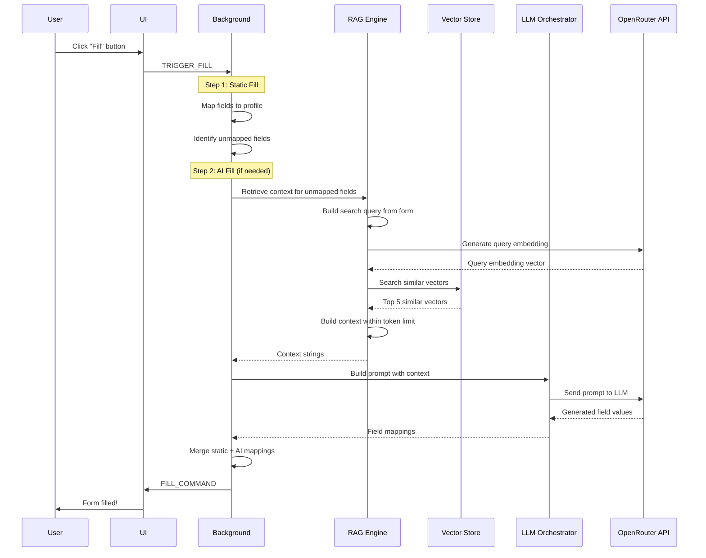

# RAG System Architecture - FormQ Extension

## Overview

The FormQ extension uses a **Retrieval Augmented Generation (RAG)** system to intelligently fill form fields by combining:
- **Retrieval**: Finding relevant past examples and knowledge from stored embeddings
- **Generation**: Using an LLM (Large Language Model) to generate appropriate field values

This document explains how embeddings are created, stored, and used for form filling.

---

## Table of Contents

1. [What is RAG?](#what-is-rag)
2. [Data Sources for Embeddings](#data-sources-for-embeddings)
3. [Embedding Generation](#embedding-generation)
4. [Vector Storage](#vector-storage)
5. [Retrieval Process](#retrieval-process)
6. [Form Filling Flow](#form-filling-flow)
7. [Code Examples](#code-examples)

---

## What is RAG?

**RAG (Retrieval Augmented Generation)** enhances AI responses by providing relevant context from a knowledge base. Instead of relying solely on the LLM's training data, RAG:

1. **Retrieves** relevant information from stored examples
2. **Augments** the LLM prompt with this context
3. **Generates** accurate responses based on both retrieval and LLM knowledge

**Benefits for Form Filling:**
- Remembers how you filled similar forms before
- Uses your personal knowledge base
- Provides consistent answers across different forms
- Reduces API costs (better context = better results)

---

## Data Sources for Embeddings

The system creates embeddings from **three sources**:

### 1. Learned Examples
**When Created**: After you manually edit an AI-filled field or submit a form

**Content**: 
- Form domain (e.g., `linkedin.com`)
- Field mappings (e.g., "Job Title → Senior Engineer")
- Timestamp

**Purpose**: Learn from your corrections and preferences

**Example**:
```
Form filled on linkedin.com:
- Job Title: Senior Software Engineer
- Years of Experience: 8
- Preferred Work Style: Remote
```

### 2. Documents
**When Created**: When you upload a resume, cover letter, or other document to a profile

**Content**: Chunked text from your documents (500 characters per chunk by default)

**Purpose**: Extract detailed information about your background

**Example Chunks**:
```
Chunk 1: "John Doe is a Senior Software Engineer with 8 years of experience 
specializing in React, Node.js, and cloud architecture..."

Chunk 2: "Previously worked at Google (2018-2023) leading a team of 5 engineers 
on customer-facing web applications..."
```

### 3. Knowledge Base (NEW)
**When Created**: When you add free-text knowledge and click "Embed Knowledge Base"

**Content**: Chunked text from your knowledge base textarea

**Purpose**: Provide contextual information that doesn't fit structured fields

**Example**:
```
I'm a senior software engineer specializing in React and Node.js. I prefer 
remote work and have 8 years of experience. My LinkedIn is linkedin.com/in/johndoe. 
I'm passionate about open source and have contributed to React Router.
```

---

## Embedding Generation

### What is an Embedding?

An **embedding** is a numerical representation (vector) of text that captures its semantic meaning. Similar texts have similar vectors.

**Example**:
- "Senior Software Engineer" → `[0.23, -0.45, 0.67, ..., 0.12]` (1536 dimensions)
- "Lead Developer" → `[0.21, -0.43, 0.65, ..., 0.14]` (similar vector!)
- "Marketing Manager" → `[-0.56, 0.78, -0.23, ..., 0.89]` (different vector)

### How Embeddings are Generated

**Service**: [`EmbeddingService.ts`](file:///home/arafat/Work/arafat-hasan/FormQ/src/background/ai/EmbeddingService.ts)

**API**: OpenRouter with model `text-embedding-3-small` (1536 dimensions)

**Process**:

```typescript
// 1. Prepare text chunks
const texts = ["chunk1", "chunk2", "chunk3"];

// 2. Send to OpenRouter API
const response = await fetch('https://openrouter.ai/api/v1/embeddings', {
    method: 'POST',
    headers: {
        'Authorization': `Bearer ${apiKey}`,
        'Content-Type': 'application/json',
    },
    body: JSON.stringify({
        model: 'text-embedding-3-small',
        input: texts,
    }),
});

// 3. Extract embedding vectors
const embeddings = response.data.map(item => item.embedding);
// Each embedding is a number[] with 1536 elements
```

**Batching**: Multiple texts are sent together to reduce API calls

**Cost**: ~$0.02 per 1M tokens (very cheap!)

---

## Vector Storage

### Storage Architecture

**Primary Storage**: IndexedDB (persistent browser storage)

**In-Memory Cache**: Map of profileId → vectors for fast access

**Schema**:

```typescript
interface VectorEntry {
    id: string;                    // Unique identifier
    profileId: string;             // Which profile owns this
    embedding: number[];           // The 1536-dimension vector
    sourceType: 'learned_example' | 'document' | 'knowledge_base';
    sourceId: string;              // Reference to source
    text: string;                  // Original text
    createdAt: number;             // Timestamp
}
```

### Storage Process

**Location**: [`VectorStore.ts`](file:///home/arafat/Work/arafat-hasan/FormQ/src/shared/storage/VectorStore.ts)

**Example - Storing Knowledge Base Embeddings**:

```typescript
// 1. User adds knowledge base text
const knowledgeBase = "I'm a senior engineer specializing in React...";

// 2. Chunk the text (500 chars each)
const chunks = chunkText(knowledgeBase, 500);
// Result: ["I'm a senior engineer...", "Previously worked at..."]

// 3. Generate embeddings
const embeddings = await embeddingService.embedBatch(chunks);

// 4. Create vector entries
const entries: VectorEntry[] = embeddings.map((result, idx) => ({
    id: `${profileId}_kb_${idx}_${Date.now()}`,
    profileId: 'profile-123',
    embedding: result.embedding,    // [0.23, -0.45, ...]
    sourceType: 'knowledge_base',
    sourceId: 'knowledge_base',
    text: chunks[idx],
    createdAt: Date.now(),
}));

// 5. Store in IndexedDB
await vectorStore.upsertBatch(entries);

// 6. Cache in memory
cache.set('profile-123', [...existingVectors, ...entries]);
```

### IndexedDB Structure

```
Database: FormQ_db
Store: vectors
Index: profileId (for fast lookup by profile)
Index: sourceType (for filtering by type)
```

---

## Retrieval Process

### How Similarity Search Works

**Algorithm**: Cosine Similarity

**Formula**:
```
similarity(A, B) = (A · B) / (||A|| × ||B||)

Where:
- A · B = dot product of vectors
- ||A|| = magnitude of vector A
```

**Result**: Value between -1 and 1 (higher = more similar)

### Retrieval Flow

**Location**: [`RAGEngine.ts`](file:///home/arafat/Work/arafat-hasan/FormQ/src/background/ai/RAGEngine.ts)

**Step-by-Step**:

```typescript
// 1. User triggers AI fill on a form
const formSignature = {
    domain: 'linkedin.com',
    fields: [
        { normalizedLabel: 'job_title', semanticClass: 'job_title' },
        { normalizedLabel: 'years_experience', semanticClass: 'unknown' },
    ]
};

// 2. Build search query from form context
const query = `Filling form on linkedin.com with fields: job_title, years_experience`;

// 3. Generate embedding for the query
const queryEmbedding = await embeddingService.embed(query);
// Result: [0.25, -0.47, 0.69, ..., 0.15]

// 4. Load all vectors for this profile
const vectors = await vectorStore.getVectors(profileId);
// Contains all learned examples + documents + knowledge base

// 5. Calculate similarity for each vector
const results = vectors.map(vector => ({
    ...vector,
    similarity: cosineSimilarity(queryEmbedding, vector.embedding)
}));

// 6. Sort by similarity and take top K
const topResults = results
    .sort((a, b) => b.similarity - a.similarity)
    .slice(0, 5);  // Top 5 most relevant

// 7. Build context string within token budget
const context = topResults.map(r => r.text).join('\n\n');
```

**Example Results**:
```
[
    {
        text: "Form filled on linkedin.com: Job Title → Senior Software Engineer",
        similarity: 0.89,  // Very relevant!
        sourceType: 'learned_example'
    },
    {
        text: "I have 8 years of experience in software development...",
        similarity: 0.76,  // Quite relevant
        sourceType: 'knowledge_base'
    },
    {
        text: "Previously worked at Google as a Senior Engineer...",
        similarity: 0.68,  // Somewhat relevant
        sourceType: 'document'
    }
]
```

---

## Form Filling Flow

### Complete RAG-Enhanced Fill Process



### Detailed Example

**Scenario**: Filling a LinkedIn job application form

**User Profile**:
- Static fields: `firstName: "John"`, `lastName: "Doe"`
- Knowledge base: "I'm a senior engineer with 8 years experience at Google"
- Learned examples: Previous LinkedIn profile update

**Form Fields**:
1. First Name
2. Last Name
3. Current Job Title
4. Years of Experience
5. Company Name

**Fill Process**:

#### Phase 1: Static Fill
```typescript
// Fields 1-2 filled from static profile
staticMappings = [
    { field: 'first_name', value: 'John', source: 'static' },
    { field: 'last_name', value: 'Doe', source: 'static' }
];

// Fields 3-5 unmapped (not in static profile)
unmappedFields = [
    { field: 'job_title', label: 'Current Job Title' },
    { field: 'years_experience', label: 'Years of Experience' },
    { field: 'company', label: 'Company Name' }
];
```

#### Phase 2: RAG Retrieval
```typescript
// Build query
query = "Filling LinkedIn form: job_title, years_experience, company";

// Get query embedding
queryEmbedding = await embeddingService.embed(query);

// Search vectors
topResults = [
    {
        text: "I'm a senior engineer with 8 years experience at Google",
        similarity: 0.92,
        sourceType: 'knowledge_base'
    },
    {
        text: "Form on linkedin.com: Job Title → Senior Software Engineer",
        similarity: 0.85,
        sourceType: 'learned_example'
    }
];

// Build context
ragContext = `
Relevant information:
1. I'm a senior engineer with 8 years experience at Google
2. Previously filled: Job Title → Senior Software Engineer
`;
```

#### Phase 3: LLM Generation
```typescript
// Build prompt
const prompt = `
You are filling a form with the following fields:
- Current Job Title
- Years of Experience  
- Company Name

User's context:
${ragContext}

Generate appropriate values in JSON format.
`;

// Send to LLM
const response = await llm.complete(prompt);

// Parse response
aiMappings = [
    { field: 'job_title', value: 'Senior Software Engineer', source: 'ai' },
    { field: 'years_experience', value: '8', source: 'ai' },
    { field: 'company', value: 'Google', source: 'ai' }
];
```

#### Phase 4: Merge & Fill
```typescript
// Combine results
finalMappings = [...staticMappings, ...aiMappings];

// Send to content script
chrome.tabs.sendMessage(tabId, {
    type: 'FILL_COMMAND',
    mappings: finalMappings
});

// Result:
// First Name: John (static)
// Last Name: Doe (static)
// Current Job Title: Senior Software Engineer (AI from RAG)
// Years of Experience: 8 (AI from RAG)
// Company Name: Google (AI from RAG)
```

---

## Code Examples

### Example 1: Ingesting Knowledge Base

```typescript
// User adds knowledge base in UI
const knowledgeBase = `
I'm a senior software engineer specializing in React and Node.js.
I prefer remote work and have 8 years of experience.
My LinkedIn is linkedin.com/in/johndoe.
`;

// Click "Embed Knowledge Base" button
async function embedKnowledgeBase(profileId: string, text: string) {
    // 1. Chunk the text
    const chunks = chunkText(text, 500);
    
    // 2. Generate embeddings
    const embeddings = await embeddingService.embedBatch(chunks);
    
    // 3. Store vectors
    const vectors: VectorEntry[] = embeddings.map((emb, idx) => ({
        id: `${profileId}_kb_${idx}_${Date.now()}`,
        profileId,
        embedding: emb.embedding,
        sourceType: 'knowledge_base',
        sourceId: 'knowledge_base',
        text: chunks[idx],
        createdAt: Date.now(),
    }));
    
    await vectorStore.upsertBatch(vectors);
    
    return chunks.length;
}
```

### Example 2: Retrieving Context

```typescript
async function getRelevantContext(
    profileId: string,
    formSignature: FormSignature,
    maxTokens: number = 1000
): Promise<string[]> {
    // 1. Build search query
    const query = `Filling form on ${formSignature.domain}: ${
        formSignature.fields.map(f => f.normalizedLabel).join(', ')
    }`;
    
    // 2. Get query embedding
    const queryEmbedding = await embeddingService.embed(query);
    
    // 3. Search vectors
    const results = await vectorStore.search(
        profileId,
        queryEmbedding,
        topK: 5,
        threshold: 0.5  // Minimum similarity
    );
    
    // 4. Build context within token budget
    const context: string[] = [];
    let tokens = 0;
    
    for (const result of results) {
        const textTokens = estimateTokens(result.text);
        if (tokens + textTokens > maxTokens) break;
        
        context.push(result.text);
        tokens += textTokens;
    }
    
    return context;
}
```

### Example 3: Learning from Edits

```typescript
// User manually edits a field after AI fill
async function learnFromEdit(
    profileId: string,
    formSignature: FormSignature,
    fieldMapping: FieldMapping,
    newValue: string
) {
    // 1. Create learned example
    const example: LearnedExample = {
        id: generateId(),
        formSignature,
        fieldMappings: [{
            ...fieldMapping,
            value: newValue,  // User's correction
        }],
        timestamp: Date.now(),
    };
    
    // 2. Build text representation
    const text = `Form filled on ${formSignature.domain}: ${
        fieldMapping.fieldSignature.normalizedLabel
    } → ${newValue}`;
    
    // 3. Generate embedding
    const embedding = await embeddingService.embed(text);
    
    // 4. Store vector
    await vectorStore.upsert({
        id: `${profileId}_example_${example.id}`,
        profileId,
        embedding,
        sourceType: 'learned_example',
        sourceId: example.id,
        text,
        createdAt: Date.now(),
    });
    
    // 5. Store example in profile
    await profileService.addLearnedExample(profileId, example);
}
```

---

## Performance & Optimization

### Token Budget Management

**Challenge**: LLM context windows have limits (e.g., 4096 tokens)

**Solution**: Smart context building with truncation

```typescript
function buildContext(results: SearchResult[], maxTokens: number) {
    const context: string[] = [];
    let totalTokens = 0;
    
    for (const result of results) {
        const tokens = estimateTokens(result.text);
        
        if (totalTokens + tokens > maxTokens) {
            // Truncate if needed
            const remaining = maxTokens - totalTokens;
            if (remaining > 50) {
                const truncated = result.text.slice(0, remaining * 4);
                context.push(truncated + '...');
            }
            break;
        }
        
        context.push(result.text);
        totalTokens += tokens;
    }
    
    return { context, tokenEstimate: totalTokens };
}
```

### Caching

**In-Memory Cache**: Vectors are cached per profile to avoid repeated IndexedDB reads

**LLM Response Cache**: Identical prompts return cached results

### Embedding Costs

**Typical Usage**:
- Knowledge base (500 words) → ~5 chunks → ~$0.0001
- Document (2000 words) → ~20 chunks → ~$0.0005
- 100 learned examples → ~$0.001

**Total for active user**: ~$0.01/month

---

## Summary

### RAG Flow Overview

```
1. DATA INGESTION
   User adds knowledge → Chunk text → Generate embeddings → Store in IndexedDB

2. FORM DETECTION
   User visits form → Extract fields → Build form signature

3. RETRIEVAL
   Build query → Generate query embedding → Search vectors → Rank by similarity

4. GENERATION
   Build prompt with RAG context → Send to LLM → Parse response

5. FILLING
   Merge static + AI mappings → Fill form fields

6. LEARNING (optional)
   User edits field → Create learned example → Store embedding
```

### Key Benefits

**Personalized**: Uses YOUR data, not generic LLM knowledge  
**Consistent**: Same answers across similar forms  
**Cost-Effective**: Better context = fewer tokens = lower cost  
**Privacy-Preserving**: All data stored locally in browser  
**Adaptive**: Learns from your corrections over time  

### File Reference

- **RAG Engine**: [`src/background/ai/RAGEngine.ts`](file:///home/arafat/Work/arafat-hasan/FormQ/src/background/ai/RAGEngine.ts)
- **Embedding Service**: [`src/background/ai/EmbeddingService.ts`](file:///home/arafat/Work/arafat-hasan/FormQ/src/background/ai/EmbeddingService.ts)
- **Vector Store**: [`src/shared/storage/VectorStore.ts`](file:///home/arafat/Work/arafat-hasan/FormQ/src/shared/storage/VectorStore.ts)
- **LLM Orchestrator**: [`src/background/ai/LLMOrchestrator.ts`](file:///home/arafat/Work/arafat-hasan/FormQ/src/background/ai/LLMOrchestrator.ts)
